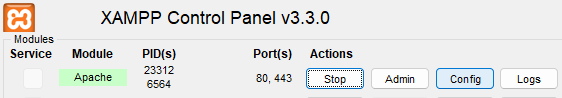
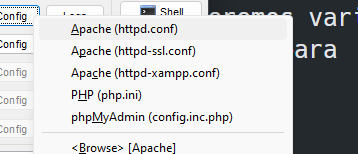
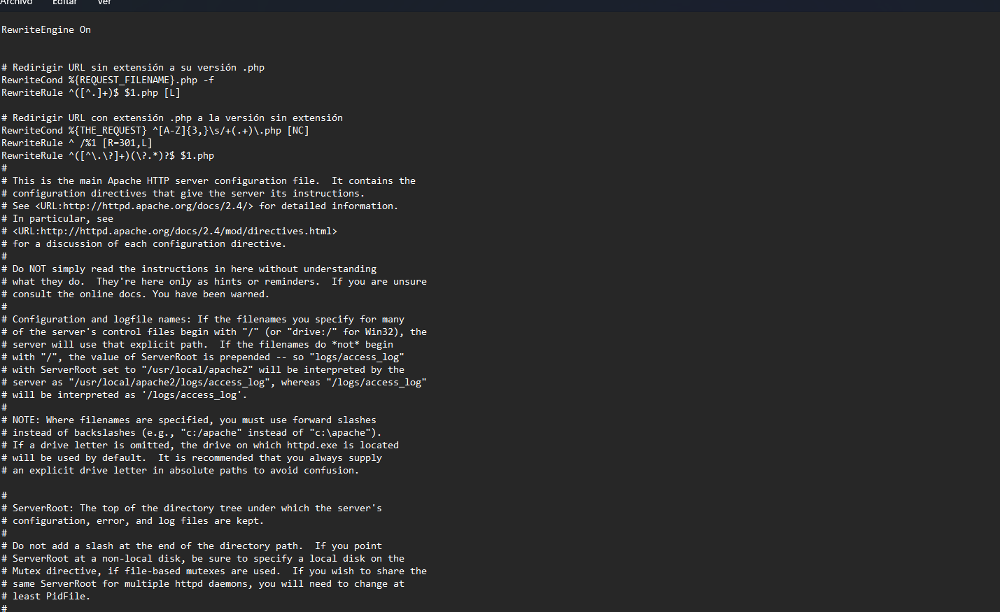
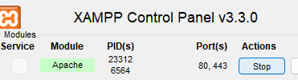

# Zamazon - Práctica de Desarrollo Web

Zamazon es un proyecto que ejemplifica un desarrollo web del lado del servidor utilizando PHP. Este proyecto abarca varios aspectos, desde la creación de una base de datos hasta la implementación de un backend funcional. Entre las funcionalidades implementadas se encuentran:

## Características

- **Login y Registro de Usuarios:** Implementación de un sistema de inicio de sesión y registro para nuevos usuarios.
- **Listado de Productos:** Visualización de productos almacenados en la base de datos.
- **Formulario para Agregar Productos:** Permite la inserción de nuevos productos en la base de datos.
- **Gestión de Relaciones en la Base de Datos:** Se implementan relaciones entre las tablas de la base de datos para una gestión eficiente de la información.

## Componentes

### Backend en PHP

El backend del proyecto está escrito en PHP y se encarga de gestionar la lógica del servidor. Entre las funcionalidades destacadas se encuentran:

- Autenticación de usuarios (login).
- Registro de nuevos usuarios.
- Consultas a la base de datos para listar y agregar productos.

### Base de Datos

El proyecto utiliza una base de datos para almacenar la información relevante de los usuarios y productos. Incluye relaciones entre tablas para una gestión eficaz de los datos.

## instrucciones

### XAMP o apache y mysql

Lo primero que tenemos que tener es apache y mysql instalado, o en su defecto tener instalado
XAMPP.
para su comodidad, te dejo el archivo de configuracion de apache(httpd.conf) en el cual he tocado el document root (directorio) y las urls no terminan con extension .php, ejemplo:

```url
antes: http://localhost/login.php
```

```url
ahora: http://localhost/login
```

Para instalar esta configuracion en tu sistema:

- 1. Abrir XAMPP y presionar en configuracion en apache
     

- 2. Seleccionamos la primera opción.
     

* 3. Se abrirá un bloc de notas con el archivo de configuración, aquí pegamos el archivo de configuración del repositorio.
     

- 4. Reiniciar Apache
     
